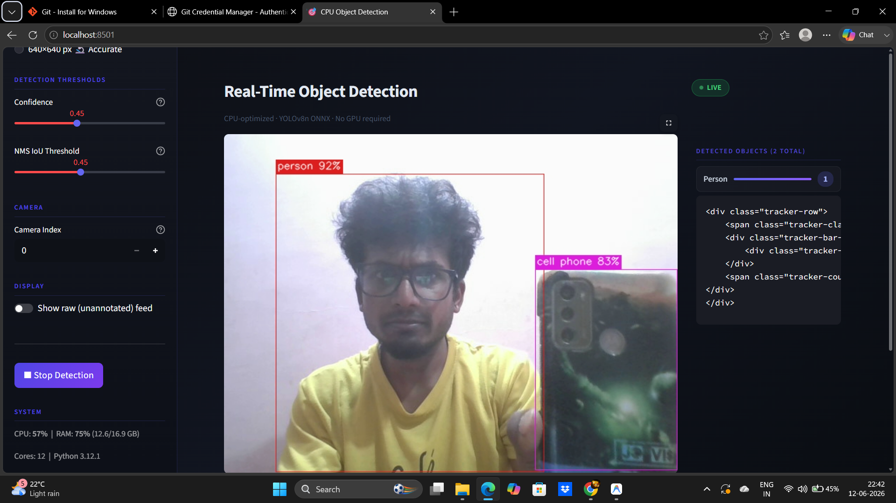

# CPU-Optimized Real-Time Object Detection System



A high-performance, real-time object detection application optimized specifically for standard CPUs — **no NVIDIA GPU required**.

---

## Tech Stack

| Layer | Library | Purpose |
|-------|---------|---------|
| AI Model | YOLOv8n / YOLO11n | Nano architecture — smallest, fastest |
| Inference | ONNX Runtime | AVX2/AVX-512 CPU vectorization |
| Vision | OpenCV (headless) | Frame capture & rendering |
| Backend | FastAPI + Uvicorn | Frame serving API |
| Frontend | Streamlit | Browser-based live UI |

---

## Project Structure

```
Object detection/
├── models/                      # Auto-created by export.py
│   └── yolov8n_imgsz640.onnx   # Exported ONNX model
├── export.py                    # Phase 1: Model download & export
├── streamer.py                  # Phase 2: Threaded frame handler
├── detector.py                  # Phase 3: ONNX inference engine
├── app.py                       # Phase 4: Streamlit UI
├── requirements.txt             # CPU-only dependencies
└── README.md                    # This file
```

---

## Quick Start

### 1. Create & Activate Virtual Environment

```bash
python -m venv venv

# Windows
venv\Scripts\activate

# macOS / Linux
source venv/bin/activate
```

### 2. Install Dependencies

```bash
pip install -r requirements.txt
```

> **Important:** `onnxruntime` (CPU-only) is used — **not** `onnxruntime-gpu`.
> This ensures the smallest install footprint and maximum CPU vectorization.

### 3. Export the Model

```bash
# Default: YOLOv8n at 640px (balanced accuracy/speed)
python export.py

# Faster: 320px input (higher FPS, slightly less accuracy)
python export.py --imgsz 320

# Alternative model: YOLO11n
python export.py --model yolo11n --imgsz 416
```

### 4. Run the App

```bash
streamlit run app.py
```

Open your browser at `http://localhost:8501`

---

## CPU Optimization Techniques

1. **Nano Architecture** — YOLOv8n has ~3.2M parameters vs ~68M for YOLOv8x
2. **ONNX Runtime** — Optimized execution providers with graph-level optimizations
3. **Static Input Shapes** — Baked into the ONNX graph for faster scheduling
4. **Frame Downsampling** — 320px inference mode cuts compute by ~75%
5. **Async Threading** — Capture and inference run on separate threads
6. **All CPU Cores** — `intra_op_num_threads` set to `os.cpu_count()`

---

## Performance Expectations (CPU)

| Hardware | Resolution | Approx FPS |
|----------|------------|------------|
| Modern i7/i9 (12th gen+) | 320px | 25–40 FPS |
| Modern i7/i9 (12th gen+) | 640px | 12–20 FPS |
| Mid-range i5 | 320px | 15–25 FPS |
| Mid-range i5 | 640px | 6–12 FPS |

---

## License

MIT
